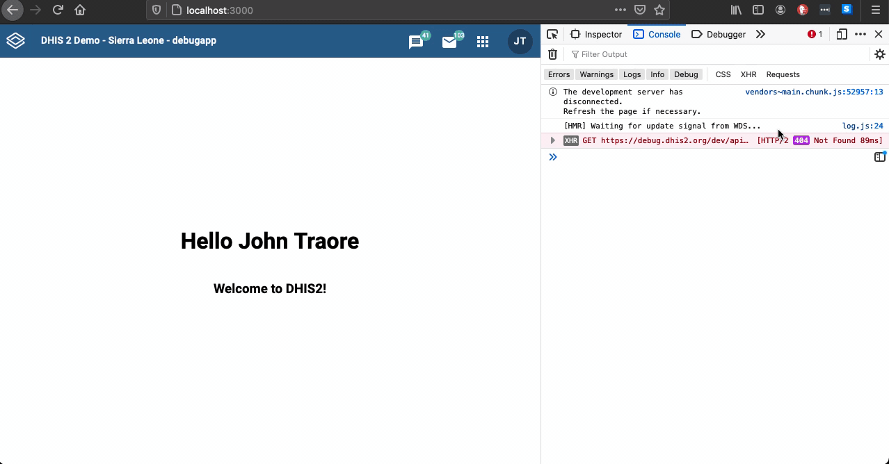

If you encounter some errors when trying to connect to your application or during development, please try the following troubleshooting steps: 

##  CORs whitelist

If you run into Cross-Origin Resource Sharing (CORs) policy issues when connecting to your server, you could start with the **CORs whitelist**. 

### What is the CORs whitelist?

In a DHIS2 instance, by default only web applications that are running on the same URL can access that DHIS2 instance. 

There's a **CORs whitelist** option that can be configured to add other URLs besides the current one and allow that DHIS2 application instance. 

### Where do I change it? 

When you login to your instance, click on the apps icon and search for **System Setting** application. Then go to **Access** from the menu on the left and scroll down to see the **CORs whitelist** option. 

There you can add the URLs that you want to grant access. The settings will be automatically updated by tabbing out of that. 

See below:

## If you're using Chrome 

There are a few things that you could do if you're using Chrome and the problem persists: 

### SameSite by default cookies flag

Disable the default SameSite Cookie behavior in Chrome by setting the "SameSite by default cookies" flag [chrome://flags/#same-site-by-default-cookies](chrome://flags/#same-site-by-default-cookies) to **Disabled**. You may need to restart your browser to apply the new setting. 

**Note**: this disables legitimate security behaviors in your browser, so proceed with caution! We recommend that you only disable this flag when actively debugging a DHIS2 application. 

Read this blog to learn more about [SameSite Cookie Policies and DHIS2 Applications](../../blog/cross-origin-cookies).  

### Disabling cache

You could also try disabling the cache from the network tab in Chrome DevTools. See below:

## Using DHIS2 Play instances

**DHIS2 Play instances**: [https://play.dhis2.org/](https://play.dhis2.org/) allow you to test out the DHIS2 platform using demo databases on the DHIS2 Play server. 

If you try to connect your application or localhost to the DHIS2 Play server and encounter some errors, please note that DHIS2 Play instances use [nginx](https://nginx.org/) as reverse proxy and this configuration is designed for security reasons, preventing cross-site cookies completely. 

To work around this issue during application development is to run a local instance of DHIS2 using Docker and the `d2 cluster` command of the [DHIS2 CLI](https://cli.dhis2.nu/#/commands/d2-cluster). Check [this guide](./spin-up-local-instance) on how to spin up a local instance. 

## Node version

Make sure that you are running a compatible version of [Node.js](https://nodejs.org/en/download/) as using older versions may throw some errors during setup. 

## HTTPs Everywhere Extension 

[HTTPs Everywhere](https://www.eff.org/https-everywhere) is a Firefox, Chrome, Opera extension created by EFF and the Tor Project which automatically switches thousands of sites from insecure "http" to secure "https". 

If you use this extension in your browser and the **Encrypt All Sites Eligible** is set to **ON**, it will break and cause errors when using unencrypted http://localhost:3000 as the extension is trying to use https://localhost:3000 for CORS. 

The best solution would be to disable the extension for `localhost`. Under **Settings for this site** click the button **Disable on this site**.  

Setting the **Encrypt All Sites Eligible** to **OFF** should work as well. See below: 

## Others?

Please let us know and we will continue adding those to the list 👌🏽 