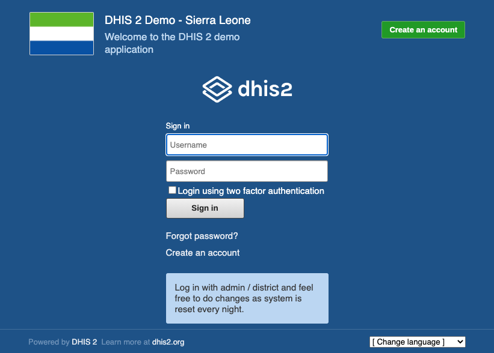

This is a quick guide on how to easily create a DHIS2 instance on your local machine and setup the DHIS2 CLI.

Some of the benefits of using local instances is that we can run multiple different DHIS2 versions at the same time and also makes testing easier as it runs locally (and it's not dependent on a network connection). 

> These steps will help you quickly spin up a server and get you started with DHIS2 application development!

## 1. Installation

First, make sure to install the following 👇

-   Install [yarn](https://classic.yarnpkg.com/en/docs/install/) and [Node.js](https://nodejs.org/en/)
-   Download [Docker](https://www.docker.com/)
-   Install the DHIS2 [CLI](https://cli.dhis2.nu/#/getting-started) globally:

```shell
yarn global add @dhis2/cli
```

Check the `d2` command-line tool with `d2 --help` for more information on available commands.

## 2. Run d2 cluster

The [d2 cluster](https://cli.dhis2.nu/#/commands/d2-cluster) command will allow you to launch a new cluster and create a DHIS2 instance using Docker containers. From your terminal, run the following:

```shell
d2 cluster up <name>
# or:
d2 cluster up 2.35.0 --db-vesion 2.35 —-seed
# this will populate a database with sample data
```

The command above uses the `d2 cluster` tool with the `up` command, the `--db-version` flag and the `--seed` flag to spin up a new DHIS2 2.35.0 instance seeded with data from the Sierra Leone [demo database](https://dhis2.org/demo).

**Note:** Once the `up` command completes, the server might take up to a couple of minutes to start. You can then run `d2 cluster logs 2.35.0` and wait until you see the line `Server startup in xxx ms`. 

> If you want to test against different DHIS2 and database versions or build your own custom DHIS2 Docker image, please refer to the [d2 cluster](https://cli.dhis2.nu/#/commands/d2-cluster) docs. 

### Check your new DHIS2 instance

After the above command has completed you can check your newly created cluster that's running locally at [http://localhost:8080/](http://localhost:8080/). If DHIS2 is running, you should see the following page: 



Login to your instance:

```
username: admin
password: district
```

### Stopping an instance

The `down` command followed by the name of the cluster shuts down all Docker processes connected to that cluster.

```shell
d2 cluster down 2.35.0
```
