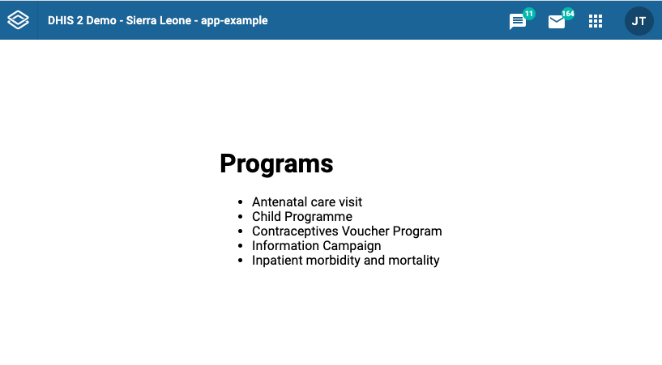

In this tutorial, you will do the following: 

1. Get started with `@dhis2/app-runtime` 
2. Learn how to define data queries 
3. Fetch data using the `useDataQuery` hook

## 1. Getting started 

### What is the DHIS2 Application Runtime?

The [DHIS2 application runtime](https://runtime.dhis2.nu/#/getting-started)  allows us to communicate with the [DHIS2 Web API](https://docs.dhis2.org/en/develop/using-the-api/dhis-core-version-master/metadata.html#webapi_browsing_the_web_api) in a declarative way - which means that we can define queries and mutations or make these requests without explicitly providing all the steps that must be performed to achieve our desired result. 

The **app runtime** is responsible for performing those steps for us, facilitating the application development experience when interacting with the DHIS2 API. 

### Installation

You can manually install the DHIS2 app runtime in your project by adding the `@dhis2/app-runtime` dependency. 

```shell
yarn add @dhis2/app-runtime
```

> **Note:** It's not necessary to install the app runtime on apps initialized with the DHIS2 Application Platform as it's included by default. If you have followed this tutorial from [Environment Setup](/docs/tutorials/setup-env) then you already have the app runtime installed in your application. 

## 2. Define data queries

First, let's define a simple data query to fetch and display the results.  

In this example, we'll use the `programs` resource from the DHIS2 Web API (the resource must be a string value corresponding to a DHIS2 resource). 

The data query below is an object that specifies the type of resource that we want but we can also declare a list of parameters that we need (`pageSize` and the `fields` array in this case). 

**Note:** the names (keys) of the parameters must correspond to the parameter names in the DHIS2 API.

```jsx title="src/App.js"
// ...
const myQuery = {
  results: {
    resource: 'programs',
    params: {
      pageSize: 5, //fetches 5 first programs in the system
      fields: ['id', 'displayName']
    },
  },
}
// ...
```

> **Useful tool** 💡: The [Data Query Playground](https://runtime.dhis2.nu/playground/) is a DHIS2 application that will help you explore the DHIS2 API and test data queries and mutations. Follow [this guide](/docs/guides/query-playground) to learn how to use it! 

## 3. Fetching data 

As mentioned earlier, the app runtime makes it very easy to fetch data from a DHIS2 instance without having to manually make these requests.

To do this, it uses [React Hooks](https://reactjs.org/docs/hooks-intro.html) and all we need to do is define declarative queries and then use the provided hook to perform the actual request. 

We have already declared our data query above, now let's use it! 👇 

### Import `useDataQuery` 

Let's start by importing the `useDataQuery` hook from the `@dhis2/app-runtime`: 

```jsx title="src/App.js"
import { useDataQuery } from '@dhis2/app-runtime'
// ...

```

### Use the `useDataQuery` hook

Next, let's define a React functional component `MyApp` which will use the `useDataQuery` hook. 

Notice that it also gives us easy access to the `error` and `loading` variables (which respond to state changes) as well as a `data` object where the fetched data is going to be stored. 

We then pass the `myQuery` object to the `useDataQuery` hook - see the highlighted line of code below: 

```jsx {15} title="src/App.js"
import React from 'react'
import { useDataQuery } from '@dhis2/app-runtime'

const myQuery = {
    results: {
      resource: 'programs',
        params: {
            pageSize: 5,
            fields: ['id', 'displayName',],
        },
    },
}

const MyApp = () => {
    const { loading, error, data } = useDataQuery(myQuery)

    if (error) {
        return <span>ERROR: {error.message}</span>
    }

    if (loading) {
        return <span>Loading...</span>
    }

    return (
        <div>
            <h1>Programs</h1>
            <ul> // Render a list of 5 programs 
                {data.results.programs.map(prog => (
                    <li key={prog.id}>
                        {prog.displayName}
                    </li>
                ))}
            </ul>
        </div>
    )
}

export default MyApp
```

### Check your browser 

Finally, you should be able to see the list of programs in your browser: 



That's it for fetching and displaying data from a DHIS2 instance API! 👏🏽

### More examples? 

* Please check the app runtime documentation for more examples [like this one](https://github.com/dhis2/app-runtime/blob/master/examples/cra/src/components/IndicatorList.js) 
* You can also try to follow [this exercise](
https://github.com/dhis2/academy-web-app-dev-2021/tree/main/workshop-1/04-app-runtime/query ) on data queries from the [web app academy 2021](/events/academy-workshops-2021)

### Want to learn more?  

* Check the [DHIS2 application runtime](https://runtime.dhis2.nu/#/) documentation or watch this [short video presentation](https://youtu.be/pvIppH5plMU?list=PLo6Seh-066Rze0f3zo-mIRRueKdhw4Vnm&t=54) introducing the app runtime (about 30 min)

* Get an overview of the DHIS2 Web API in this [video presentation](https://youtu.be/F95LTzAzESQ?list=PLo6Seh-066Rze0f3zo-mIRRueKdhw4Vnm) (about 30 min) or check out the [DHIS2 Core Web API](https://docs.dhis2.org/en/develop/using-the-api/dhis-core-version-master/introduction.html) documentation 

## What's next? 

In the next section, you’ll learn how to use the `useDataMutation` hook to mutate or write data! 


