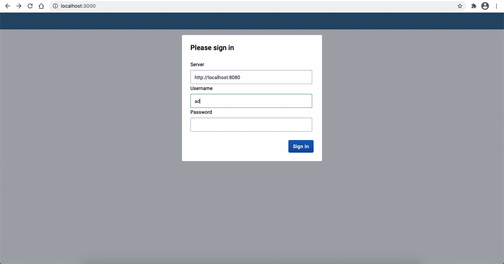

This tutorial will help you set up your local development environment to build your first DHIS2 app using the [DHIS2 Application Platform](https://platform.dhis2.nu/#/), which provides a fully-featured DHIS2 app, with out-of-the-box tools and components ready to be customized for your use case. 

In this section we will:

1. Install the [DHIS2 CLI](https://cli.dhis2.nu/#/)
2. Spin up a DHIS2 instance with [d2 cluster](https://cli.dhis2.nu/#/commands/d2-cluster) 
3. Initialize a new DHIS2 app 

## Before you start 

You will need to have the following installed before proceeding:

1. Install [Node.js](https://nodejs.org/en/download/)

Make sure that you are running a compatible version of Node as using older versions may throw some errors during setup. 

2. Install [Yarn](https://yarnpkg.com/getting-started/install)

## 1. Install the DHIS2 CLI

We'll start by installing the [DHIS2 CLI](https://cli.dhis2.nu/#/) (Command Line Interface) globally. 

The `@dhis2/cli` package provides a set of tools that are useful when developing DHIS2 apps. It contains a number of modules that lets you quickly create and maintain DHIS2 applications. It also allows you to manage local DHIS2 instances by running simple commands. 

To install `@dhis2/cli` globally run the following command using `Yarn`:  

```shell
yarn global add @dhis2/cli
```

Verify your installation and check all the commands that are available to you: 

```shell
d2 --help
```

You’re now ready to start using `@dhis2/cli` commands to spin up a DHIS2 local instance and to create a new app! ✨

## 2. Spin up a DHIS2 instance with `d2 cluster`

_This is a very important step as you will need to connect your new app to this DHIS2 instance in [Step 3](#3-initialize-a-new-dhis2-app), which will be your **server**._  

The [d2 cluster](https://cli.dhis2.nu/#/commands/d2-cluster) command will allow you to launch a new cluster and create a DHIS2 instance using Docker containers. 

Some of the benefits of using local instances is that we can run multiple different DHIS2 versions at the same time and also makes testing easier as it runs locally (and it's not dependent on a network connection). 

Before you start, you would need to have Docker installed on your computer. So please go ahead and download [Docker](https://www.docker.com/).  

Now you can quickly start a new DHIS2 instance by running the following command from your terminal: 

```shell
d2 cluster up <name>
# or:
d2 cluster up 2.35.0 --db-version 2.35 —-seed
# this will populate a database with sample data
```

The command above uses the `d2 cluster` tool with the `up` command, the `--db-version` flag and the `--seed` flag to spin up a new DHIS2 2.35.0 instance seeded with data from the Sierra Leone [demo database](https://dhis2.org/demo).

> If you want to test against different DHIS2 and database versions or build your own custom DHIS2 Docker image, please check the [DHIS2 CLI](https://cli.dhis2.nu/#/commands/d2-cluster) documentation for more information. 

For more d2 cluster commands, run `d2 cluster --help`.

### Check your new DHIS2 instance

After the above command has completed you can check your newly created cluster that's running locally at [http://localhost:8080/](http://localhost:8080/). If DHIS2 is running, you should see the following page: 


Sign in as `admin` (username) and `district` (password). If you can load DHIS2 in the browser, you are ready to create a new app. 

### Stopping an instance

The `down` command followed by the name of the cluster shuts down all Docker processes connected to that cluster.

```shell
d2 cluster down 2.35.0
```

## 3. Initialize a new DHIS2 app

Now you are ready to use the `d2` CLI tool to create your first DHIS2 app. 

The `d2` CLI provides a simple way of initializing a new app. We'll use the [d2-app-scripts init command](https://platform.dhis2.nu/#/scripts/init) to do that. 

From your terminal, navigate to the where you want to create your project and then run the following command: 

```shell
d2 app scripts init <app-name>
# <app-name> must be replaced with your app name.
``` 
We can now navigate into the newly created folder and start your application locally: 

```shell
yarn start
```

### Connecting your app to the DHIS2 instance 

After running `yarn start`, a web-browser window should have popped up greeting you with a login dialog at [http://localhost:3000](http://localhost:3000). 

Enter your DHIS2 server URL and the username and password of the default admin user (as shown below): 

```
server: http://localhost:8080
username: admin
password: district
```

You will then see your newly initialized application greeting screen like this one 👇 



**NOTE**: If you're running into some Cross-Origin Resource Sharing [(CORs)](https://developer.mozilla.org/en-US/docs/Web/HTTP/CORS) policy issues when trying to connect to your application, please check the guide on [how to debug common development errors](../guides/debug-instance). 

### Set up code-style with DHIS2 style

Before you start developing your application, it can be very helpful to follow the DHIS2 style guide to ensure that you write clean, readable, and functional code for your DHIS2 apps. 

To do this, the `d2` CLI provides a tool that checks and fixes the style of JavaScript and text files in your repository.  The tool, called [d2-style](https://cli-style.dhis2.nu/), runs [`prettier`](https://prettier.io/) and [`eslint`](https://eslint.org) under the hood with [a standardized configuration](https://github.com/dhis2/cli-style/tree/master/config/js).  It also installs git hooks with [husky](https://github.com/typicode/husky) which will automatically check your code style before making a `git` commit!

* Run this command to automatically set up the project to follow the DHIS2 style guidelines: 

```shell
d2 style install project/react
```

* Add lint and format scripts

```shell
yarn add @dhis2/cli-style --dev
```

* Then, add the following scripts to `package.json`:

```js
// package.json
{
    // ...
    "scripts": {
        // ...
        "lint": "d2-style js check && d2-style text check",
        "format": "d2-style js apply && d2-style text apply"
    }
}
```

* And try out your new scripts!

```shell
yarn lint
yarn format
```

**That's it!** 

**Congratulations! You are now ready to start developing a DHIS2 application!** 👏🏽

## What's next? 

In the next tutorial you will learn about DHIS2 components and the UI library! 