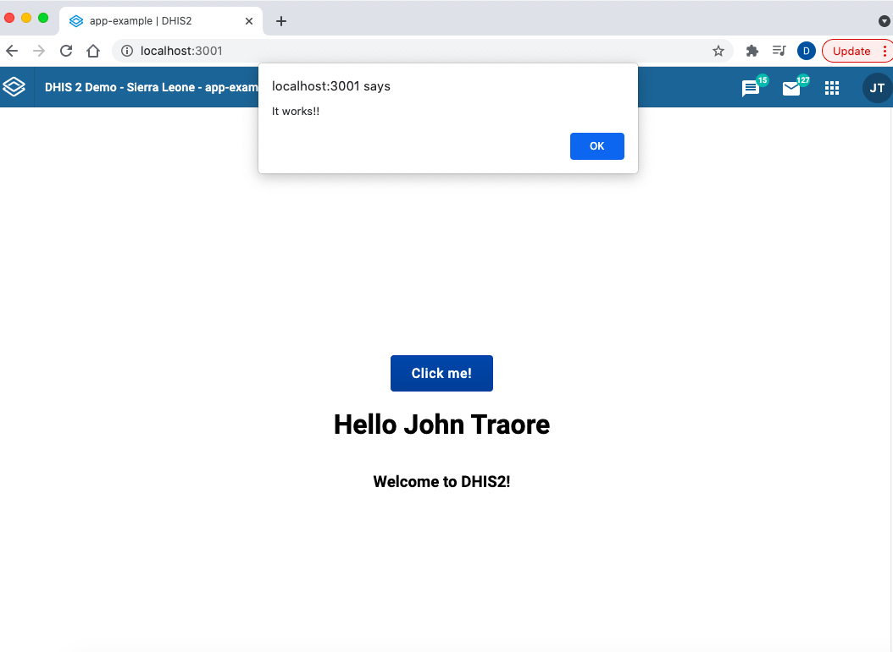

In this tutorial you will do the following: 

1. Get started with the `@dhis2/ui` library 
2. Import and use UI components into your application

## Prerequisites 

Before we continue, make sure that you followed the steps provided in the first tutorial: [Environment Setup](/docs/tutorials/setup-env) 

## 1. Getting started 

### DHIS2 Design System 

The UI library is the implementation of the [DHIS2 Design System](https://github.com/dhis2/design-system#dhis2-design-system). Using this system you can design and build applications that are usable, powerful and consistent with other DHIS2 applications.

### Live demos documentation  

To learn more about the [DHIS2 UI library](https://ui.dhis2.nu/#/) and see a list of demos, make sure to check out the [live demos documentation](https://ui.dhis2.nu/demo/?path=/story/about-this-documentation-for-readers--page) that uses Storybook to showcase all available components. Here, you will find a description for each component and you will be able to interact with its props. You can also find code snippets for each demo to easily copy and paste them into your project. 

### Installation

To get started using the DHIS2 UI library, navigate to your project and add `@dhis2/ui` as a dependency:

```shell
yarn add @dhis2/ui
```

## 2. Import and use UI components 

In this example, we'll be adding a simple `Button` component to get familiar with the UI library and learn how to import and use its components. 

### Add a Button

First, open up the `src/App.js` file and import a [Button](https://ui.dhis2.nu/demo/?path=/docs/actions-buttons-button--basic) into our application as shown below: 


```js
import { Button } from '@dhis2/ui'
```

Then, we'll add a `Button` component that's `primary` and `large`. 

Remember that you can easily copy and paste the code from the [documentation](https://ui.dhis2.nu/demo/?path=/docs/actions-buttons-button--basic). 

You should have something like this: 

```jsx {5,11-13} title="src/App.js"
import { DataQuery } from '@dhis2/app-runtime'
import i18n from '@dhis2/d2-i18n'
import React from 'react'
import classes from './App.module.css'
import { Button } from '@dhis2/ui'

// ...

const MyApp = () => (
    <div className={classes.container}>
        <Button name="Primary button" onClick={logger} primary large value="default">
            Click me!
        </Button>
       
        // ...
       
    </div>
)

export default MyApp
```

#### The `onClick` event handler 

As we copied this code directly from the documentation, we get the function `onClick={logger}` as the event handler. However, `logger` hasn't been defined so you may get an error. To test if this function works, let's pass the following function instead: 

```jsx {3}
    <Button 
        name="Primary button" 
        onClick={() => window.alert("It works!")} 
        primary value="default"> 
        Click me!
    </Button>
```

In your browser, you should be able to see something similar when you click the button:



That's it for the `Button` component! 👏🏽

> **If you want to add more components to your application, make sure to follow this quick guide on [How to add a Table component](/docs/guides/ui-table)!**

### Want to learn more?  

* Check the [DHIS2 Design System](https://github.com/dhis2/design-system#dhis2-design-system) repo or watch this [short presentation](https://youtu.be/Brvi4DsIRN8?list=PLo6Seh-066Rze0f3zo-mIRRueKdhw4Vnm&t=43 ) (less than 15 min)

* Check the [UI Library Storybook documentation](https://ui.dhis2.nu/demo/?path=/docs/about-this-documentation-for-readers--page) or watch this [short demo](https://youtu.be/Brvi4DsIRN8?list=PLo6Seh-066Rze0f3zo-mIRRueKdhw4Vnm&t=802) about it (about 15 min) 

## What's next? 

In the next tutorial you will learn how to interact with the DHIS2 Web API and fetch data using the DHIS2 App Runtime! 

